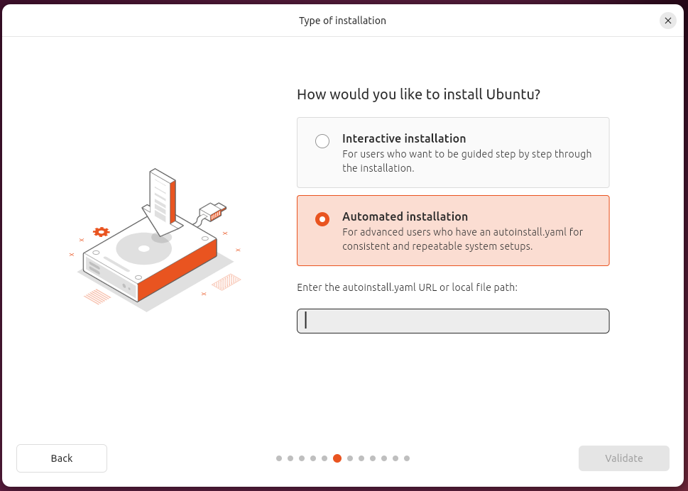

# Description

This repo is for storing the autoinstall configuration for the Ubuntu v24.04+ installer.

# Usage

1. Copy the URL from the `autoinstall.yml` file using the **Raw** link
1. Select **Automated installation** and paste the URL, you copied above, into the **Enter the `autoinstall.yaml` URL or local file path** box
   
1. Click **Validate**

